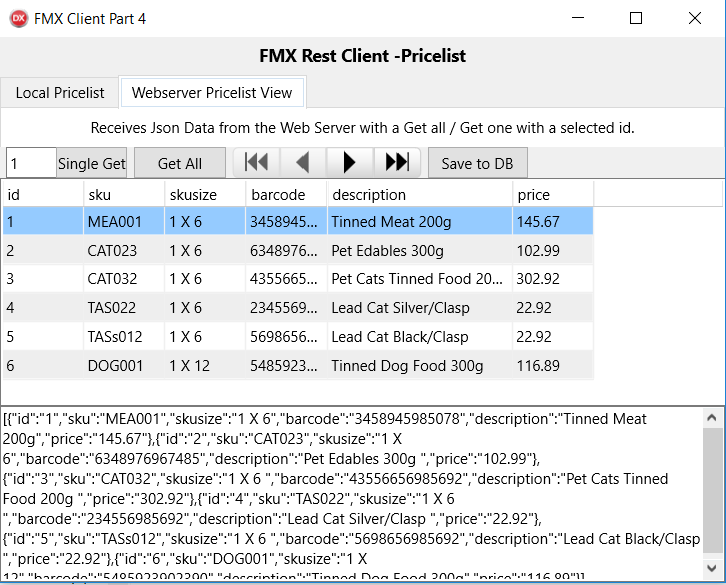
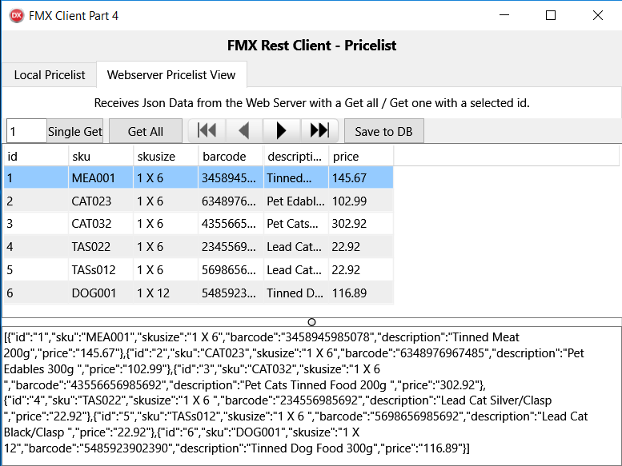
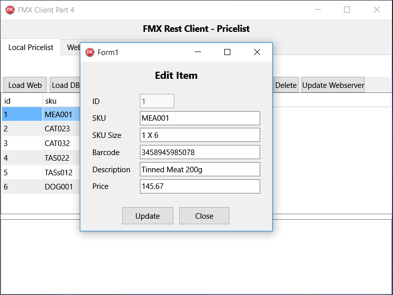

**Delphi FMX Rest Client Application Part 4**

**Background**

This is the Firemonkey version of Part 3 VCL version making use of the newer
RESTclient, RESTrequest and RESTresponse library. This forms part of a move from
VCL to FMX. In this case using the REST components required a full rewrite.

Doing this also would give me the writer an opportunity to gain a Developers
emotional feel for the effective comparison of the Indy library and the Newer
REST library. My thoughts are expressed in the Summary.

**Scope**

-   Continue with the same theme that was used in Part 1 to 3.

-   Upgrade the project to newer REST -Components available with the latest
    current 10.2.1 Tokyo IDE - Enterprise.

-   Use the FMX platform rather than VCL. The same can be created in VCL.
    However all my projects are being converted or rewritten in FMX to take
    advantage of the cross-platform option.

-   For this Project, keep the application and functionality feel to be the same
    as the VCL project where possible.

-   Summarise the positives and negatives using Indy vs Rest products as a
    developers’ tool.

Project Component Changes

For this FMX project, the following were replaced:-

-   INDY Components -\> RESTClient Components.

-   Third Party SuperObject (json library) -\> No json code written (However
    wrote a simple Json parser for the Database.

-   Clientdataset -\> FDmemtable.

**Project Layout**

**Layout and Rest Structure**

A feature that is offered by Embarcadero is the REST Debugger which allows you
to connect directly to your Rest Server.

Once connected and you have viewed the tabular data use the ‘Copy Components’
Button which allows all the required components to be copied directly into your
application.

Whilst this allows you to set up a working application with no code written.
This is a great embarcadero team’s Implementation, but what if you have many
different calls that needs to be made to a typical REST Server. Using the REST
Debugger, a new full Rest component set is created for each individual
Get,Post,Delete and Header URI call made. This would result in a Datamodule full
of REST components.

I see no harm in having this except that it would add overhead to your
application. Creating a Windows Application is of no consequence these days
however when writing for mobile already you are penalized by the size of your
created app, you are forced to focus on reduced overhead inclusion. Actually you
need to continually allow for lots of included threaded code to pull your app
together.

The only time that you may have multiple components, is if you were making
multiple calls at the same time asynchronously.

For this Application only one call is made at a time so it requires One
RESTclient ,RESTrequest and RESTresponse component ,used with Two FDmemtables ,
each connected to these REST-components with a RESTDataSetAdapter. So in the
datamodule we have one set in place.

A FDStanStorageJsonLink allows json data file to be saved and loaded.

This is used to simulate a Database that would normally be connected to your
application.

Each FDmemtable is connected to a Tgrid using a Bindsource.

A tabcontrol is set up with two tabs.

Tabitem1 – Local Pricelist

This autoloads the simulated pricelist from the Database.

7 options are available:-

-   Load the Webserver Pricelist.

-   Load from Database

-   Save to Database

-   Create a new Item in Database

-   Edit a Database Item

-   Delete an item in the database

-   Update the Webserver Pricing with Current changed or loaded Database.

Tabitem2 – Webserver Pricelist View.

This auto loads the Webserver Pricelist from the Webserver.

Three options are available :-

-   Get One item

-   Get All items

-   Save to the Simulated Database.

Here we make use of the RESTResponseDatasetAdapter that will parse the Json data
into a memTable.

This is part of the built in functionalty of the Rest Components. Actually a
nice feature!

The code for calling a Get All data from the Webserver as follows:-

{code}

procedure Tfmmain.getwebbtnClick(Sender: TObject);

var

JValue:TJSONValue;

begin

Memo2.clearcontent;

dm.RESTResponseDataSetAdapter1.Dataset:= DM.FDMemTable2;

dm.RESTResponseDataSetAdapter1.Active:= true;

dm.RESTClient1.BaseURL:=
'https://www.bayeseanblog.com/blog/public/demo/salesrest/public/api/pricing';

dm.RESTRequest1.method:= TRESTRequestMethod.rmGET;

try

dm.RESTRequest1.Execute;

if dm.restresponse1.StatusCode \<\> 200 then

begin

memo1.Text:= dm.restresponse1.Errormessage;

exit

end;

jValue:=dm.RESTResponse1.JSONValue;

Memo2.Text:= jValue.ToString;

except

on exception:ERESTException do

Showmessage('Could not connect to Webserver');

on exception:ERequestError do

Showmessage('Could not connect to the Internet');

end;

end;

procedure Tfmmain.btngetallClick(Sender: TObject);

var

JValue:TJSONValue;

begin

dm.RESTClient2.Bindsource.Active:=false;

Memo1.Lines.Clear;

dm.RESTClient2.Bindsource.Active:=true;

dm.RESTResponseDataSetAdapter1.dataset:= dm.FDMemTable1;

dm.RESTResponseDataSetAdapter1.Active:=true;

dm.RESTClient1.BaseURL:=
'https://www.bayeseanblog.com/blog/public/demo/salesrest/public/api/pricing';

dm.RESTRequest1.method:= TRESTRequestMethod.rmGET;

dm.RESTRequest1.Execute;

//get response message status

if dm.restresponse1.StatusCode \<\> 200 then

begin

memo1.lines.Add(dm.restresponse1.Errormessage);

end

else

begin

jValue:=dm.RESTResponse1.JSONValue;

Memo1.lines.Add(jValue.ToString);

end;

dm.RESTResponseDataSetAdapter1.dataset:= dm.FDMemTable2;

dm.RESTResponseDataSetAdapter1.Active:=true;

end;

{/code}

This is the routine to Post to the REST WebServer. This first calls a delete all
on the REST WebServer and then posts the new data directly to the WebServer.
This is the easiest way to ensure data integrity for this process.

{code}

procedure Tfmmain.PosttowebbtnClick(Sender: TObject);

var

JValue:TJSONValue;

JText:string;

jparse:string;

begin

Memo1.Lines.Clear;

//delete all items on the web

dm.RestRequest2.Body.ClearBody;

dm.RESTClient2.BaseURL:=
'https://www.bayeseanblog.com/blog/public/demo/salesrest/public/api/pricing/delete/0';

dm.RESTRequest2.method:= TRESTRequestMethod.rmDelete;

dm.RESTRequest2.Execute;

memo1.lines.add('Deleting all Data on Webserver.....');

memo1.lines.add(dm.RESTResponse2.Content + ' Status Code : '
+inttostr(dm.RESTResponse2.StatusCode) + ' '+ dm.RESTResponse2.StatusText );

memo1.lines.add('');

memo1.lines.add('Adding Data to Webserver.....');

dm.RestRequest2.Body.ClearBody;

//dm.RESTRequest2.Body.Add(Jtext,Trestcontenttype.ctTEXT_PLAIN);

dm.RESTRequest2.Body.Add(setJsondatafromtable(dm.fdmemtable1),Trestcontenttype.ctAPPLICATION_JSON);

dm.RESTClient2.BaseURL:=
'https://www.bayeseanblog.com/blog/public/demo/salesrest/public/api/pricing/add/all';

dm.RESTRequest2.method:= TRESTRequestMethod.rmPost;

dm.RESTRequest2.Execute;

Memo1.lines.Add(dm.RESTResponse2.content+ ' Status Code : '
+inttostr(dm.RESTResponse2.StatusCode) + ' '+ dm.RESTResponse2.StatusText );

memo1.lines.Add(setJsondatafromtable(dm.fdmemtable1));

dm.FDMemTable1.First;

end;

{/code}

In FormShow the Fielddefs are created for the two memtables. This is required as
a simulated Database is used for this example.

procedure Tfmmain.FormShow(Sender: TObject);

begin

with dm do

begin

FDMemTable1.FieldDefs.Add('id',ftWideString,20,False);

FDMemTable1.FieldDefs.Add('sku',ftWidestring,20,False);

FDMemTable1.FieldDefs.Add('skusize',ftWidestring,20,False);

FDMemTable1.FieldDefs.Add('barcode',ftWidestring, 20,false);

FDMemTable1.FieldDefs.Add('description',ftWidestring,100,False);

FDMemTable1.FieldDefs.Add('price',ftWidestring,30,false);

FDmemtable1.CreateDataset;

FDMemTable2.FieldDefs.Add('id',ftWideString,20,False);

FDMemTable2.FieldDefs.Add('sku',ftWidestring,20,False);

FDMemTable2.FieldDefs.Add('skusize',ftWidestring,20,False);

FDMemTable2.FieldDefs.Add('barcode',ftWidestring, 20,false);

FDMemTable2.FieldDefs.Add('description',ftWidestring,100,False);

FDMemTable2.FieldDefs.Add('price',ftWidestring,30,false);

FDmemtable2.CreateDataset;

end;

Edit2.Text:= '1';

//set the tab to loaded file

loadfromsimulatedDB;

tabcontrol1.ActiveTab:= tabitem2;

//populate from the Web

getwebbtnclick(self);

end;

function Tfmmain.setJsondatafromtable(memtable: TFDmemtable):string;

var

openbracket:string;

endbracket:string;

begin

memtable.DisableControls;

memtable.active:= true;

memtable.first;

openbracket:= '[';

endbracket:= ']';

while not memtable.Eof do

begin

if memtable.RecNo = 1 then

begin

result:= openbracket+

ParsetoJson(

// dm.FDMemTable1.FieldByName('id').Asstring,

dm.FDMemTable1.FieldByName('sku').Asstring,

dm.FDMemTable1.FieldByName('skusize').Asstring,

dm.FDMemTable1.FieldByName('description').Asstring,

dm.FDMemTable1.FieldByName('barcode').Asstring,

dm.FDMemTable1.FieldByName('price').Asstring)+',';

end;

if(( memtable.RecNo \>1 )and (memtable.RecNo \< memtable.RecordCount) )then

begin

Result:= result + ParsetoJson(

// dm.FDMemTable1.FieldByName('id').Asstring,

dm.FDMemTable1.FieldByName('sku').Asstring,

dm.FDMemTable1.FieldByName('skusize').Asstring,

dm.FDMemTable1.FieldByName('description').Asstring,

dm.FDMemTable1.FieldByName('barcode').Asstring,

dm.FDMemTable1.FieldByName('price').Asstring) +',';

end;

if(memtable.RecNo = memtable.RecordCount) then

begin

result:= result+ ParsetoJson(

// dm.FDMemTable1.FieldByName('id').Asstring,

dm.FDMemTable1.FieldByName('sku').Asstring,

dm.FDMemTable1.FieldByName('skusize').Asstring,

dm.FDMemTable1.FieldByName('description').Asstring,

dm.FDMemTable1.FieldByName('barcode').Asstring,

dm.FDMemTable1.FieldByName('price').Asstring) +endbracket;

end;

memtable.next;

end;

memtable.First;

memtable.EnableControls

end;

end.

{/code}

The Jason parser to parse from the Database into Json Format .

{code}

unit jsonparser;

interface

uses System.Json;

function ParsetoJson(sku,skusize,barcode,description,price:string):string ;

implementation

function ParsetoJson(sku,skusize,barcode,description,price:string):string ;

var

Obj: TJSONObject;

begin

Obj := TJSONObject.Create;

// Obj.AddPair('id', index);

Obj.AddPair('sku', sku);

Obj.AddPair('skusize', skusize);

Obj.AddPair('barcode', barcode);

Obj.AddPair('description', description);

Obj.AddPair('price', price);

result:= Obj.toJson ;

obj.Free;

end;

{/code}

**Summary**

The FMX Application was quicker to write with less code to write than with the
Indy Products when incorporating the ‘SuperObjects’ Json library.

However when integrating the REST side, I found writing the Vcl application Part
3 easier using Indy components as the required call logic was typical ‘Delphi’
in nature. So figuring out how to call custom headers was logical.

Using One set of Rest components, calling custom headers using the
‘Rest-Request’ component would not work out of the box especially when making
multiple different calls processing different Custom Headers. Once I found the
solution, then all worked and all was simple thereafter.

Firemonkey logic feels like learning a new language all over again but one gets
used to its way. Fortunately FMX makes for writing less and less functions,
procedures and properties. However typically the first 80% of the app is written
quickly but the last 20% becomes time consuming as not everything always ties
naturally together and there is ALWAYS a lot of head scratching to eventually
make the App function as it should.

That being said, the rewards on completion cannot be understood unless you are a
Delphi developer.

The Rest components have OpenSSL directly built -in and this makes ‘https’
calling straight forward. Google and others are on a charge to encourage all
websites to use ‘https.’ It is best to consider that in a few years or less,
‘http’ will not be used in the main stream.

For Indy you will need an OpenSSL.dll or OpenSSL.so included in your deployment
.

Be aware that using OpenSSL binary is not straight forward when writing an
Android Application as it will clash with Android’s change to ‘Boring SSL’ in
Android 6 and up. Fortunately there are alternative
[Binaries](https://forums.embarcadero.com/thread.jspa?threadID=211147) available
on the Embarcadero Forum that will eliminate the clash. Just means a little bit
more work to implement Indy components.

Perhaps Embarcadero should incorporate OpenSSL internally into the Indy
components that have been evolving over time.

The Rest components have a lot to offer and with Oauth2 built in capability
makes the implementation far quicker than using the Indy components. Be prepared
for more secure rest security connection methods. Oauth2 will soon be out done
by a new more secure protocol. Oauth3? Perhaps something else?

Both Indy and Rest components work fast enough for my requirement and I did not
measure the speed efficiency between them. It is more important to ensure that
on connection that your Rest Service is providing the necessary speed required.

Fortunately a combination of Indy and the Rest components will ensure that just
about all is covered.

Read the final Part 5 covering Authentication for both PHP Rest Server and
Delphi Vcl and Firemonkey Client Apps at the blogsite.

Happy Coding
